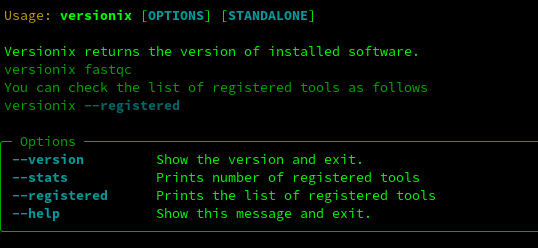

Versionix
###########

.. image:: https://badge.fury.io/py/versionix.svg
    :target: https://pypi.python.org/pypi/versionix

.. image:: https://github.com/sequana/versionix/actions/workflows/main.yml/badge.svg
   :target: https://github.com/sequana/versionix/actions/workflows/main.yml

.. image:: https://coveralls.io/repos/github/sequana/versionix/badge.svg?branch=main
    :target: https://coveralls.io/github/sequana/versionix?branch=main

.. image:: https://zenodo.org/badge/658721856.svg
   :target: https://zenodo.org/badge/latestdoi/658721856

:Python version: Python 3.8, 3.9, 3.10, 3.11, 3.12
:Source: See  `http://github.com/sequana/versionix <https://github.com/sequana/versionix/>`__.
:Issues: Please fill a report on `github <https://github.com/sequana/versionix/issues>`__

Overview
========

Versionix is a lightweight tool designed to display the version of standalone software directly on the screen, handling
various versioning formats.

Installation
----------------

If you are in a hurry, just type::

    pip install versionix  --upgrade

This is pure Python so no need for fancy libraries.

Usage
-----

Then, just type **versionix** followed by an executable installed on your system, e.g for linux users::

    versionix ls

where **ls** is a standard command. In bioinformatics, **fastqc** is quite common. You can check its version as
follows::

    versionix fastqc

**versionix** prints the version as X.Y.Z string.

Most tools would work. However, a registry is available for complex cases. Registered tools can be obtained with the following command. If your favorite tool is not there, create a PR or an issue::

    versionix --registered

Type::

    versionix --help

to get more help like this example:

For developers only
-------------------

Contributions are welcome. Please submit pull requests. If you do so, please also add or update tests if needed.

We use pytest, that can be used as follow in the root of the project:

    pytest -v --cov versionix

DESCRIPTION
===========

The first difficulty is that standalone applications have different ways to obtain their version information. Some require the use of a long or short argument (--version or -v), while others do not require any argument at all. In addition, display channels (stdout or stderr) and formats of the version output differs between applications. To handle these various cases, we define a regular expression that should work for maybe 80% of applications (difficult to estimate). For non standard case, a dictionnary of **metadata** related to the different standalones is available. These metadata helps in the identification of the command to run, the options to use, if the information is directed to stdout or stderr and the method to parse the output to obtain the version number.

Versionix is designed to be used with all Sequana pipelines and is not intended to be universal. You can add your own standalone version in the versionix/register.py file and provide a Pull Request.

Changelog
=========

========= ========================================================================
Version   Description
========= ========================================================================
0.99.2    Handle cases where e.g. --version is returned to the stderr (instead of
          stdout)
0.99.1    Remove warning if we are using registered entry.
0.99.0    Final version before 1.0.0
0.3.0     Refactor to use regular expression and registry only if needed. This
          make versionix quite generic.
0.2.4     More tools in the registry and added precommit
0.2.3     More tools in the registry
0.2.2     add all tools required by sequana pipelines (oct 2023)
0.2.1     More tools added.
0.2       simplification. Add tests. Add more tools
0.1       first draft
========= ========================================================================
