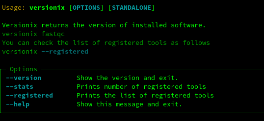

Versionix
###########

.. image:: https://badge.fury.io/py/versionix.svg
    :target: https://pypi.python.org/pypi/versionix
    :alt: Latest PyPI version

.. image:: https://img.shields.io/pypi/pyversions/versionix.svg
    :target: https://pypi.python.org/pypi/versionix
    :alt: Supported Python versions

.. image:: https://github.com/sequana/versionix/actions/workflows/main.yml/badge.svg
   :target: https://github.com/sequana/versionix/actions/workflows/main.yml
   :alt: CI status

.. image:: https://coveralls.io/repos/github/sequana/versionix/badge.svg?branch=main
    :target: https://coveralls.io/github/sequana/versionix?branch=main
    :alt: Coverage

.. image:: https://img.shields.io/badge/license-BSD--3--Clause-blue.svg
    :target: https://github.com/sequana/versionix/blob/main/LICENSE
    :alt: License

----

**Versionix** is a lightweight Python tool that retrieves and displays the version of any
standalone software — handling the many different version output formats found in the wild.

:Source: `github.com/sequana/versionix <https://github.com/sequana/versionix/>`__
:Issues: `github.com/sequana/versionix/issues <https://github.com/sequana/versionix/issues>`__
:Changelog: See the `Changelog`_ section below

----

.. contents:: Table of Contents
   :depth: 2
   :local:

Overview
========

Many standalone tools expose their version in different ways:

- Some require ``--version``, some ``-v``, and some no argument at all.
- Some write to *stdout*, others to *stderr*.
- Version strings come in many formats (``1.2.3``, ``v1.2.3``, ``tool 1.2.3 (build ...)``, …).

**Versionix** handles all of these cases automatically. For ~80 % of tools the built-in
regular-expression heuristic is enough; for the rest a curated *registry* of metadata
ensures the right command is run and the right output channel is parsed.

Key features
------------

- 🔍 **Auto-detection** — works out-of-the-box for the vast majority of tools
- 📋 **Registry** — curated metadata for tools with non-standard version output
- 🐍 **Pure Python** — no compiled dependencies; works on any platform
- ⚡ **Fast** — single subprocess call, minimal overhead
- 🔗 **Library API** — importable ``get_version()`` function for use in your own code

Installation
============

Install from PyPI with pip::

    pip install versionix --upgrade

No extra dependencies are required beyond the Python standard library and a handful of
small pure-Python packages.

Usage
=====

Command line
------------

Just type ``versionix`` followed by the name of any executable on your ``$PATH``::

    versionix ls          # any system command
    versionix fastqc      # common bioinformatics tool
    versionix bwa

``versionix`` prints a clean ``X.Y.Z`` version string to the terminal.

List all registered tools::

    versionix --registered

Full help::

    versionix --help

Python API
----------

You can also call ``get_version`` directly from Python::

    from versionix.parser import get_version

    version = get_version("fastqc")
    print(version)  # e.g. "0.11.9"

How it works
============

The first difficulty is that standalone applications have different ways to obtain their
version information. Some require the use of a long or short argument (``--version`` or
``-v``), while others do not require any argument at all. In addition, the display
channel (stdout or stderr) and the format of the version output differ between
applications.

To handle these various cases, Versionix uses a regular expression that covers the
majority of applications. For non-standard cases, a dictionary of **metadata** for each
registered standalone is available. These metadata specify:

- the command and options to run,
- whether to read *stdout* or *stderr*, and
- how to parse the output to extract the version string.

Versionix is designed to be used with all `Sequana <https://github.com/sequana>`_
pipelines and is not intended to be universal. You can add support for your own tool by
editing ``versionix/registry.py`` and opening a Pull Request.

Contributing
============

Contributions are very welcome! Please:

1. Fork the repository and create a feature branch.
2. Add or update tests as appropriate.
3. Open a Pull Request against ``main``.

Run the test suite locally with::

    pytest -v --cov versionix

Changelog
=========

========= ========================================================================
Version   Description
========= ========================================================================
0.99.4    allow introspection of apptainers
0.99.3    Maintenance release
0.99.2    Handle cases where e.g. --version is returned to the stderr (instead of
          stdout)
0.99.1    Remove warning if we are using registered entry.
0.99.0    Final version before 1.0.0
0.3.0     Refactor to use regular expression and registry only if needed. This
          makes versionix quite generic.
0.2.4     More tools in the registry and added precommit
0.2.3     More tools in the registry
0.2.2     add all tools required by sequana pipelines (oct 2023)
0.2.1     More tools added.
0.2       simplification. Add tests. Add more tools
0.1       first draft
========= ========================================================================
